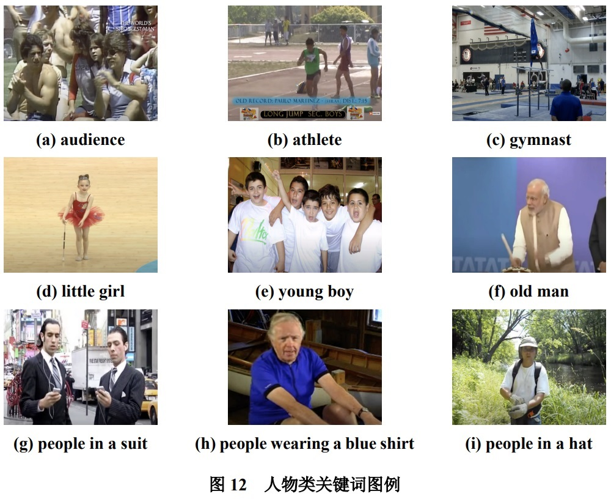
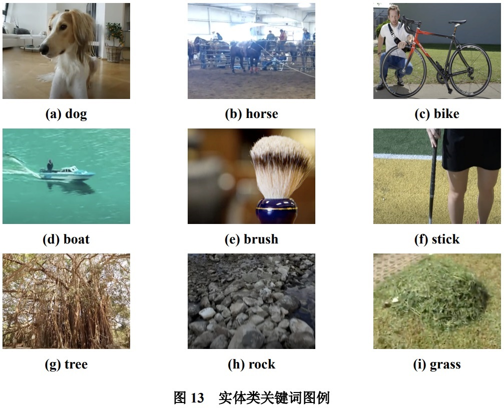
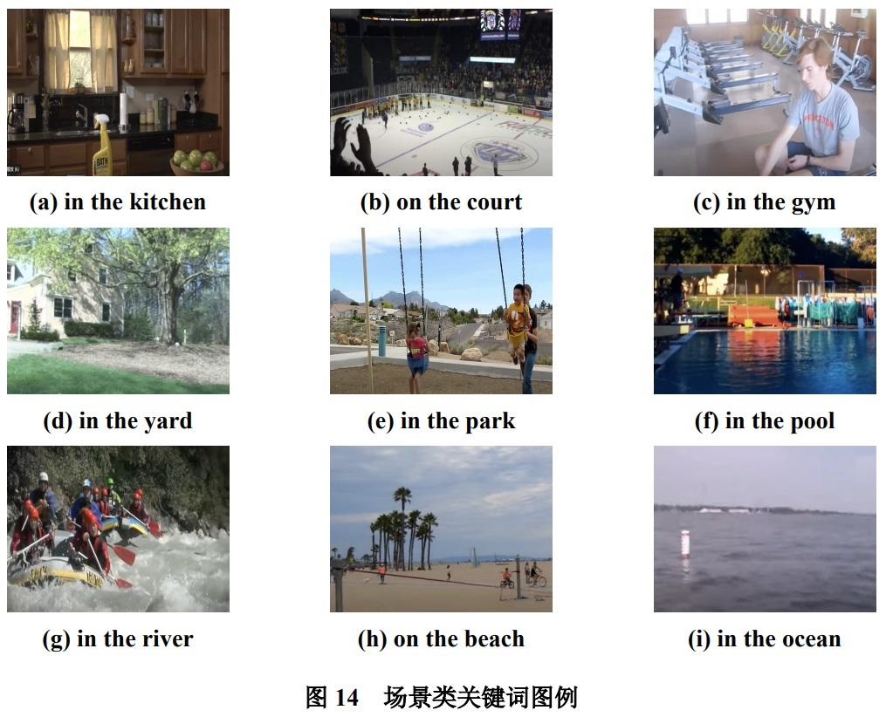
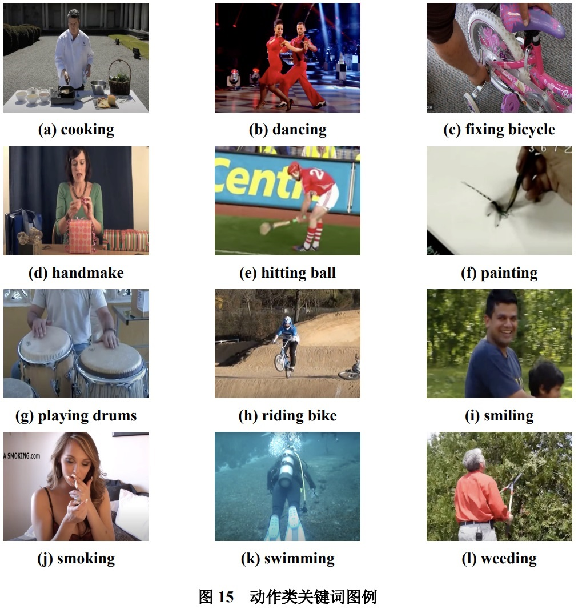
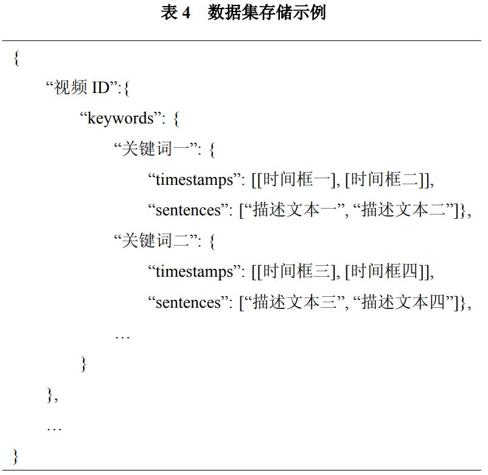

# Transformer-for-Personalized-Video-Captioning


A PyTorch implementation for the Transformer for Personalized Video Captioning (TPVC) model to perform the keyword-guided personalized video captioning task.


## Requirement

- Python >= 3.7
- torch >= 1.11.0
- torchtext >= 0.12.0
- numpy >= 1.17.2
- pycocoevalcap >= 1.2

## Preparation

### Clone

```bash
git clone https://github.com/AuxinChen/Transformer-for-Personalized-Video-Captioning.git
```

### Create an anaconda environment:

```bash
conda create -n tpvc python=3.7
conda activate tpvc
pip install -r requirements.txt
```

## Usage

### Download Video Features

```sh
cd feature/c3d
bash download_anet_c3d.sh
python convert_c3d_h5_to_npy.py
cd feature/tsn
bash download_tsn_features.sh
```

### Training

```sh
python train.py --feature_type tsn --mask_weight 1.0 --gated_mask
```

### Validation

```sh
python test.py --feature_type tsn --checkpoint checkpoint.pt --learn_mask --gated_mask
```

## Dataset

We provide a novel personalized video caption dataset named ActivityNet-QC. This dataset contains quadruplets of video, keywords, captions and the temporal segments.







## Example


## License

MIT
